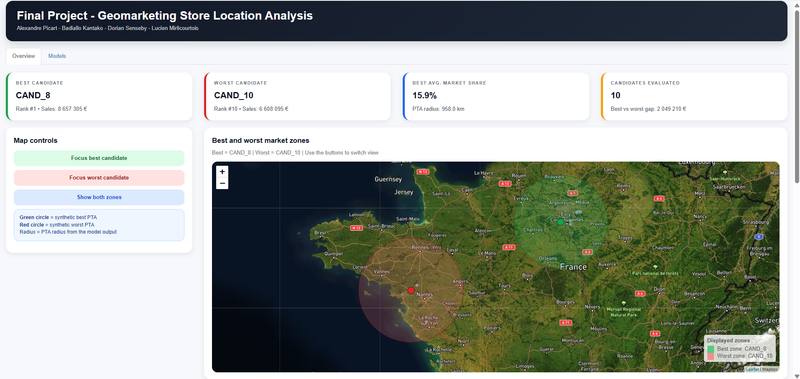

# Geomarketing Retail Location Analysis

This project was completed as part of the Geomarketing course at the Toulouse School of Economics.

The objective was to identify promising locations for future retail store openings by combining gravity models, principal trading areas (PTA), and spatial econometric methods.

## Project Contents

- Final report
- R code
- Shiny application
- Visual outputs

## Live App

[Open the Shiny app](https://alexandrepicart.shinyapps.io/final_project/)

## Preview

## Files

## Files

- `Final_project_report.pdf`: final written report presenting the project context, methodology, econometric specifications, candidate evaluation process, and main results.
- `app.R`: Shiny application used to visualize the results interactively, including the map of candidate locations, key performance indicators, and comparative charts.
- `code_projet.R`: main R script used for the analytical work behind the project, including data preparation, model estimation, and candidate location evaluation.
- `app_overview.png`: screenshot of the Shiny dashboard used as a visual preview in this README.

## Tools

- R
- Shiny
- Leaflet
- Spatial analysis
- Econometric modeling

